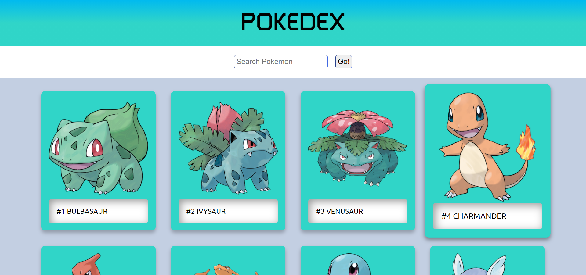

# Pokedex App
A Simple Pokedex app created using React(CRA) & PokeAPI(Work In Progress).

Created as a part of [React Course by ZTM - React Basics Part](https://www.udemy.com/course/complete-react-developer-zero-to-mastery/)

[Demo - Deployed to Vercel](https://pokedex-react-app.vercel.app/)

Feedback is Welcome!

